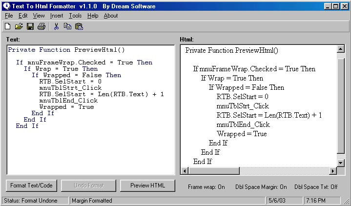



## Text To HTML Formatter v1\.1\.0 \(UPDATED 5\-20\-03 ComboSort relaced with superior WordSort\)

### Description

Website Submitters Must See. This Will Format Your Code/Text/Article/Tutorial Into HTML Format and save you heaps of time submitting your ideas trying to convert text or even code into HTML Friendly Format. Martin K. sent me a 'Tweaked' copy of v1.0.0 and I have continued work from there. Also added Color coded RTB, Frame Wrap, Insert Menu, Print option, Resize Text and WebBrowser windows (not form) with form drag Added VB.frm Filter to remove 'rubbish' from file while loading code Some nice bas added by Martin, also and credit to Will Barden for his RTB Color .bas. Please comment and vote!
 
### More Info
 
Text/Text based files/vb code/etc

HTML Formatted text ready to copy and paste onto website or save to file.

Saves you a heap of time believe me!

             |
---                |---
**Submitted On**   |2003-05-20 16:47:20
**By**             |[Dream](https://github.com/Planet-Source-Code/PSCIndex/blob/master/ByAuthor/dream.md)
**Level**          |Intermediate
**User Rating**    |4.4 (66 globes from 15 users)
**Compatibility**  |VB 6\.0
**Category**       |[Complete Applications](https://github.com/Planet-Source-Code/PSCIndex/blob/master/ByCategory/complete-applications__1-27.md)
**World**          |[Visual Basic](https://github.com/Planet-Source-Code/PSCIndex/blob/master/ByWorld/visual-basic.md)
**Archive File**   |[Text\_To\_HT1589745202003\.zip](https://github.com/Planet-Source-Code/dream-text-to-html-formatter-v1-1-0-updated-5-20-03-combosort-relaced-with-superior-wordso__1-45293/archive/master.zip)

